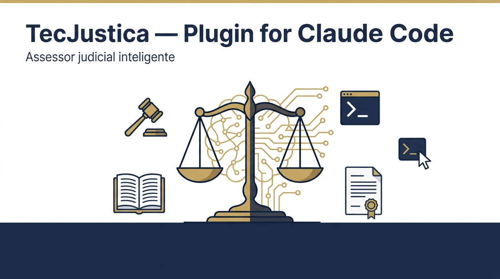
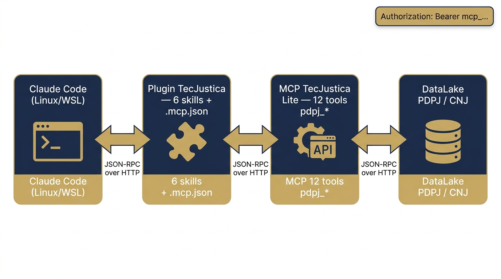
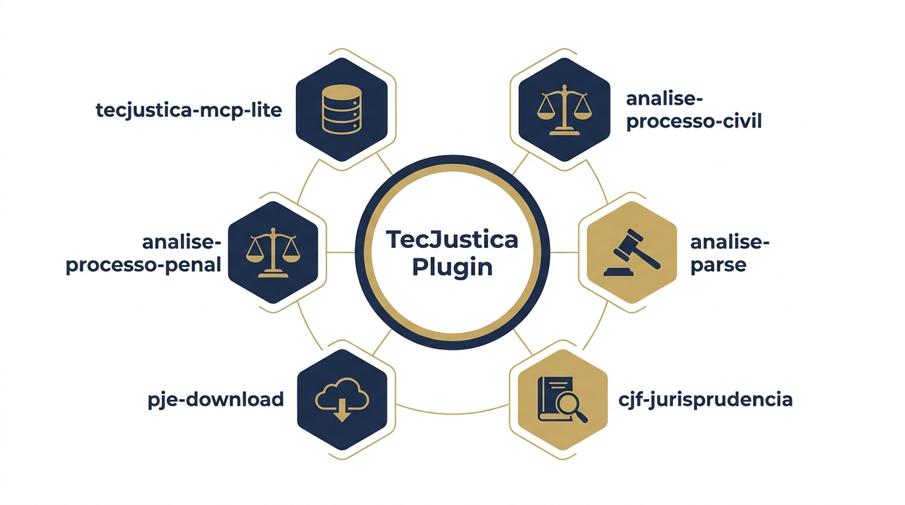
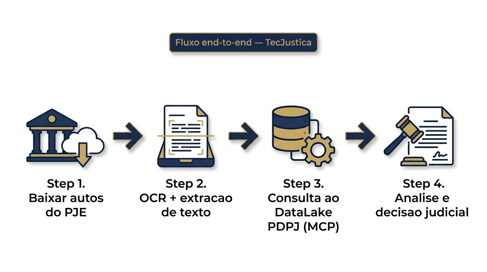

# Plugin TecJustica para Claude Code



Assessoria judicial inteligente para processos civeis e penais brasileiros. Analise processual, elaboracao de decisoes, pesquisa de jurisprudencia, download de autos do PJE, OCR de PDFs e calculos de prazos — tudo integrado via skills do Claude Code e o MCP Lite TecJustica (DataLake PDPJ/CNJ).

O plugin reune **6 skills** que trabalham em conjunto para dar ao magistrado, assessor ou advogado um ambiente de trabalho completo dentro do Claude Code.

## Arquitetura



O Claude Code carrega o **plugin TecJustica**, que expoe 6 skills e registra o servidor **MCP TecJustica Lite** via `mcp-remote`. O MCP Lite consome o **DataLake PDPJ** do CNJ e devolve processos, documentos, movimentacoes e precedentes em tempo real. Tudo roda sobre JSON-RPC via HTTP, autenticado com sua chave `mcp_...`.

## Sumario

- [Portais TecJustica](#portais-tecjustica)
- [Plataforma suportada](#plataforma-suportada)
- [Pre-requisitos](#pre-requisitos)
- [Instalacao automatica (atalho)](#instalacao-automatica-atalho)
- [Passo 1 — Instalar dependencias do sistema](#passo-1--instalar-dependencias-do-sistema)
- [Passo 2 — Obter suas chaves de API](#passo-2--obter-suas-chaves-de-api)
- [Passo 3 — Configurar variaveis de ambiente](#passo-3--configurar-variaveis-de-ambiente)
- [Passo 4 — Instalar o plugin](#passo-4--instalar-o-plugin)
- [Passo 5 — Verificar a instalacao](#passo-5--verificar-a-instalacao)
- [Skills incluidas](#skills-incluidas)
- [Exemplos de uso](#exemplos-de-uso)
- [Fluxo completo de teste](#fluxo-completo-de-teste)
- [Gerenciamento do plugin](#gerenciamento-do-plugin)
- [Troubleshooting](#troubleshooting)
- [Licenca](#licenca)

---

## Portais TecJustica

Antes de instalar o plugin voce precisa criar conta em **pelo menos um** dos dois portais da TecJustica. Cada servico tem sua propria chave de API.

### 🏛️ MCP TecJustica Lite (obrigatorio)

> **https://tecjusticamcp-lite-production.up.railway.app/**

Este e o **portal principal** do plugin. E onde voce cria sua conta, obtem a chave `mcp_...` e acessa o MCP TecJustica Lite, que alimenta todas as skills de analise processual (`tecjustica-mcp-lite`, `analise-processo-civil`, `analise-processo-penal`). Sem essa chave, o plugin nao consegue ler processos, movimentacoes, documentos nem buscar precedentes no DataLake PDPJ/CNJ.

- **Cadastro:** https://tecjusticamcp-lite-production.up.railway.app/registro
- **Login e geracao de chave:** https://tecjusticamcp-lite-production.up.railway.app/
- **Prefixo da chave:** `mcp_...`
- **Variavel de ambiente:** `TECJUSTICA_API_KEY`

### 📄 TecJustica Dashboard (opcional — OCR de PDFs)

> **https://tecjustica-dashboard-production.up.railway.app/**

Portal secundario, dedicado ao servico **TecJustica Parse** — a API de OCR com PaddleOCR GPU usada pela skill `tecjustica-parse`. Crie conta aqui **apenas se voce for extrair texto de PDFs** (certidoes, matriculas, autos escaneados, etc.). Quem so for usar analise processual via MCP pode pular este passo.

- **Cadastro e painel:** https://tecjustica-dashboard-production.up.railway.app/
- **Prefixo da chave:** `tjp_...`
- **Variavel de ambiente:** `TECJUSTICA_PARSE_API_KEY`

> ⚠️ **As duas chaves nao sao intercambiaveis.** A chave `mcp_...` nao funciona no Parse, e a chave `tjp_...` nao funciona no MCP. Cada servico tem seu proprio cadastro.

---

## Plataforma suportada

O plugin e projetado para **Claude Code rodando em Linux ou WSL2**.

| Sistema | Suporte | Observacao |
|---------|:---:|-----------|
| Linux (Ubuntu, Debian, Fedora, etc.) | ✅ Nativo | Recomendado |
| macOS (Intel ou Apple Silicon) | ✅ Nativo | Funciona igual ao Linux |
| Windows via **WSL2** (Ubuntu) | ✅ Suportado | Unica forma suportada em maquinas Windows |
| Windows nativo (fora do WSL) | ❌ Nao suportado | `browser-use` CLI e `mcp-remote` tem limitacoes fora de ambiente Linux |

### Instalando WSL2 no Windows (uma vez)

1. Abra o **PowerShell como administrador** e execute:

   ```powershell
   wsl --install
   ```

2. Reinicie o Windows quando pedido.

3. No primeiro boot, o Ubuntu vai abrir e pedir para voce criar um usuario Linux e uma senha. Esses **nao** precisam ser iguais aos do Windows.

4. Todos os comandos a partir daqui sao executados **dentro do terminal do Ubuntu/WSL**, nunca no PowerShell.

> **Dica:** instale o [Windows Terminal](https://aka.ms/terminal) na Microsoft Store — ele abre abas do Ubuntu/WSL automaticamente e e mais comodo que o console padrao.

---

## Pre-requisitos

A tabela abaixo resume tudo. Os passos detalhados vem na proxima secao.

| Item | Obrigatorio para | Como instalar |
|------|------------------|---------------|
| Claude Code | Tudo | Secao 1.1 |
| Node.js 18+ | MCP TecJustica (todas skills de analise) | Secao 1.2 |
| `curl`, `python3`, `bash` | `tecjustica-parse`, `tecjustica-docx` | Ja vem no Linux/WSL |
| Google Chrome | `pje-download`, `cjf-jurisprudencia` | Secao 1.3 |
| `browser-use` CLI | `pje-download`, `cjf-jurisprudencia` | Secao 1.4 |
| LibreOffice headless | `tecjustica-docx` (conversao DOCX -> PDF) | Secao 1.5 |
| `python-docx` | `tecjustica-docx` (geracao de DOCX) | Secao 1.6 |
| Fontes editoriais (EB Garamond + IBM Plex) | `tecjustica-docx` (identidade visual executiva) | Secao 1.7 |
| Chave API MCP (`mcp_...`) | MCP TecJustica | Secao 2.1 |
| Chave API Parse (`tjp_...`) | `tecjustica-parse` | Secao 2.2 (opcional) |
| Credenciais PJE TJCE | `pje-download` | Voce ja deve ter como magistrado/servidor/advogado |

---

## Instalacao automatica (atalho)

Se voce quer pular os passos manuais, o repositorio traz um script `install.sh` que instala todas as dependencias, pede suas chaves de API interativamente e configura o `~/.bashrc`.

**IMPORTANTE sobre sudo:** o script precisa instalar varios pacotes do sistema (Node.js, Chrome, LibreOffice, fontes editoriais) e por isso exige acesso sudo. Ele pede sua senha **uma unica vez** no inicio e mantem a sessao autenticada para o resto da instalacao — voce nao vai precisar digitar a senha 5 vezes seguidas.

```bash
# Opcao 1: rodar direto do GitHub (recomendado — precisa de tty para sudo)
curl -fsSL https://raw.githubusercontent.com/marcosmarf27/tecjustica/main/install.sh | bash
```

Ou, se preferir clonar antes para auditar:

```bash
git clone https://github.com/marcosmarf27/tecjustica.git
cd tecjustica
bash install.sh
```

O script cobre:

1. Detecta plataforma (Linux nativo, WSL2 ou macOS)
2. Pede sua senha sudo **uma unica vez** e mantem a sessao ativa durante toda a instalacao
3. Instala Node.js 18+
4. Instala Google Chrome
5. Instala `browser-use` CLI
6. Instala LibreOffice headless (para `tecjustica-docx` converter DOCX -> PDF)
7. Instala `python-docx` via pip (para `tecjustica-docx` gerar DOCX)
8. Instala fontes editoriais (EB Garamond + IBM Plex Sans/Mono + Inconsolata + Caladea + Carlito) — essenciais para a identidade visual de `tecjustica-docx`
9. Verifica se Claude Code esta instalado (avisa se faltar)
10. Pede as duas chaves de API (MCP Lite e Parse) e escreve no `~/.bashrc`

**Flags uteis:**

| Flag | O que faz |
|------|-----------|
| `--check-only` | So diagnostica o que ja esta instalado, nao instala nada |
| `--no-interactive` | Nao pede chaves (le `TECJUSTICA_API_KEY`/`TECJUSTICA_PARSE_API_KEY` do ambiente) |
| `--skip-node` | Nao instala Node.js |
| `--skip-chrome` | Nao instala Chrome |
| `--skip-browser-use` | Nao instala browser-use |
| `--skip-libreoffice` | Nao instala LibreOffice (tecjustica-docx nao conseguira gerar PDF) |
| `--skip-python-docx` | Nao instala python-docx (tecjustica-docx nao conseguira gerar DOCX) |
| `--skip-fonts` | Nao instala fontes editoriais (tecjustica-docx usara fallbacks genericos) |
| `--skip-env` | Nao mexe no `~/.bashrc` |

Depois do script terminar, **abra um novo terminal** para as variaveis serem carregadas e siga direto para o [Passo 4 — Instalar o plugin](#passo-4--instalar-o-plugin-o-mcp-vem-junto).

> Se voce prefere fazer tudo manualmente (para entender o que esta acontecendo ou para adaptar a outra distro), ignore este atalho e siga os passos 1 a 5 abaixo.

---

## Passo 1 — Instalar dependencias do sistema

Execute no terminal do Linux/WSL (Ubuntu assumido — adapte `apt` para sua distro).

### 1.1 Claude Code

Se voce ainda nao tem:

```bash
curl -fsSL https://claude.ai/install.sh | bash
```

Depois abra um novo terminal e confirme:

```bash
claude --version
```

### 1.2 Node.js 18+ (necessario para `npx mcp-remote`)

```bash
# Instalar a versao LTS do Node via NodeSource
curl -fsSL https://deb.nodesource.com/setup_lts.x | sudo -E bash -
sudo apt install -y nodejs

# Confirmar
node --version    # deve mostrar v18 ou superior
npm --version
```

### 1.3 Google Chrome (necessario para `pje-download` e `cjf-jurisprudencia`)

```bash
# Baixar o .deb oficial
wget https://dl.google.com/linux/direct/google-chrome-stable_current_amd64.deb

# Instalar
sudo apt install -y ./google-chrome-stable_current_amd64.deb

# Confirmar
google-chrome --version
```

> **WSL2:** o Chrome instalado dentro do WSL usa o WSLg automaticamente para abrir janelas no Windows. Se a janela nao aparecer, atualize o WSL (`wsl --update` no PowerShell) e tente de novo.

### 1.4 `browser-use` CLI

```bash
# Instalar o CLI
curl -fsSL https://browser-use.com/cli/install.sh | bash

# Adicionar ao PATH permanentemente
echo 'export PATH="$HOME/.browser-use-env/bin:$PATH"' >> ~/.bashrc
source ~/.bashrc

# Validar instalacao
browser-use doctor
```

A saida do `browser-use doctor` deve indicar que Python, dependencias e o binario Chromium/Chrome estao OK. Se algo aparecer como faltando, siga a orientacao do proprio comando.

### 1.5 LibreOffice headless (necessario para `tecjustica-docx` gerar PDF)

A skill `tecjustica-docx` cria relatorios processuais profissionais em DOCX e converte para PDF via LibreOffice headless. Sem o LibreOffice, a skill ainda gera o DOCX, mas a conversao PDF falha.

```bash
sudo apt install -y libreoffice-core libreoffice-writer --no-install-recommends

# Confirmar
libreoffice --version
```

O pacote `--no-install-recommends` evita puxar dezenas de MB extras (Calc, Impress, Draw, Base, temas) que nao sao usados. So precisamos do Writer para renderizar o DOCX e exportar PDF.

> **Fidelidade de fontes:** o LibreOffice substitui automaticamente fontes que nao estao instaladas. Para relatorios identicos aos gerados no Word, instale tambem as fontes Microsoft core:
> ```bash
> sudo apt install -y ttf-mscorefonts-installer fonts-crosextra-carlito
> ```

### 1.6 `python-docx` (necessario para `tecjustica-docx` gerar DOCX)

```bash
# Ubuntu 24+ exige --break-system-packages devido ao PEP 668
pip install --user --break-system-packages python-docx

# Confirmar
python3 -c "import docx; print(docx.__version__)"
```

A biblioteca `python-docx` tem cerca de 1 MB e nao puxa dependencias pesadas. Ela e usada pelo `docx_builder.py` da skill `tecjustica-docx` para montar DOCX programaticamente com capa, sumario, tabelas estilizadas, timeline processual, quotes de jurisprudencia, data cards e callouts na paleta visual do TecJustica.

### 1.7 Fontes editoriais (necessarias para o design executivo de `tecjustica-docx`)

A skill `tecjustica-docx` foi calibrada no padrao visual de bancas de investimento e consultorias top-tier (Goldman, JP Morgan, McKinsey, BCG), o que depende de uma combinacao tipografica especifica:

- **EB Garamond** — serifa transicional classica (display + body)
- **IBM Plex Sans** — sans-serif institucional (labels e eyebrows)
- **IBM Plex Mono** — monoespaçada (document ID, datas, paginacao)
- **Inconsolata** — mono editorial (fallback)
- **Caladea** — metrico-compativel com Cambria
- **Carlito** — metrico-compativel com Calibri

Sem essas fontes, o LibreOffice substitui automaticamente por fallbacks genericos (Liberation Serif / DejaVu Sans) e o relatorio perde sua identidade visual institucional.

```bash
sudo apt install -y \
  fonts-ebgaramond \
  fonts-ebgaramond-extra \
  fonts-ibm-plex \
  fonts-inconsolata \
  fonts-crosextra-caladea \
  fonts-crosextra-carlito

# Atualizar o cache de fontes do sistema
fc-cache -f

# Validar
fc-list | grep -E "EB Garamond|IBM Plex"
```

No macOS:

```bash
brew install --cask font-eb-garamond font-ibm-plex font-inconsolata
```

Total instalado: ~20 MB.

---

## Passo 2 — Obter suas chaves de API

O plugin usa **duas chaves distintas**, uma por portal. Veja a secao [Portais TecJustica](#portais-tecjustica) acima para contexto. Tabela-resumo:

| Chave | Prefixo | Portal | Usada por | Obrigatoria? |
|-------|---------|--------|-----------|:---:|
| MCP TecJustica Lite | `mcp_...` | [tecjusticamcp-lite-production.up.railway.app](https://tecjusticamcp-lite-production.up.railway.app/) | `tecjustica-mcp-lite`, `analise-processo-civil`, `analise-processo-penal` | **Sim** |
| TecJustica Parse | `tjp_...` | [tecjustica-dashboard-production.up.railway.app](https://tecjustica-dashboard-production.up.railway.app/) | `tecjustica-parse` | So se usar OCR |

### 2.1 Chave do MCP TecJustica Lite (obrigatoria)

Este e o **portal principal do plugin**. Sem esta chave, nenhuma das skills de analise processual funciona.

1. Acesse **https://tecjusticamcp-lite-production.up.railway.app/registro**
2. Crie uma conta (email + senha)
3. Faca login em **https://tecjusticamcp-lite-production.up.railway.app/** e gere uma API key no painel
4. O valor retornado comeca com `mcp_` seguido de caracteres alfanumericos (ex: `mcp_4ef2e6bc187049949c41955150b76bd5`)
5. **Copie e guarde em local seguro** — dependendo do painel, a chave pode nao ser exibida de novo

### 2.2 Chave da TecJustica Parse (opcional — so se for usar OCR)

Necessaria apenas se voce quiser usar a skill `tecjustica-parse` para extrair texto de PDFs via OCR (PaddleOCR GPU + IA Vision).

1. Acesse **https://tecjustica-dashboard-production.up.railway.app/**
2. Crie uma conta
3. No painel, gere uma API key — comeca com `tjp_` (ex: `tjp_5e67cee9099f4b558c1f2e57b5f83aef`)
4. Copie e guarde

> **Lembrete:** o cadastro do Dashboard (Parse) e **independente** do cadastro do MCP Lite. Voce precisa criar contas separadas em cada portal.

---

## Passo 3 — Onde colocar as chaves de API

**As chaves nao vao em nenhum arquivo de configuracao manual.** Elas sao lidas pelo plugin a partir de **variaveis de ambiente** do seu terminal. Quando o Claude Code for aberto, ele herda essas variaveis e as repassa para o servidor MCP e para a skill de OCR.

### Resumo visual

```
Voce define no ~/.bashrc        ─┐
  TECJUSTICA_API_KEY=mcp_...     │
  TECJUSTICA_PARSE_API_KEY=tjp_  │
                                 ▼
Abre um novo terminal              (as variaveis ja estao no ambiente)
                                 │
                                 ▼
Roda `claude` no terminal          (Claude Code herda as variaveis)
                                 │
                                 ▼
Claude carrega o plugin            .mcp.json usa ${TECJUSTICA_API_KEY}
                                 scripts da parse usam ${TECJUSTICA_PARSE_API_KEY}
```

### 3.1 Editar o `~/.bashrc` (ou `~/.zshrc` se usa zsh)

Execute uma vez:

```bash
cat >> ~/.bashrc <<'EOF'

# TecJustica — chaves de API (duas distintas, prefixos diferentes)
export TECJUSTICA_API_KEY=mcp_SUBSTITUA_PELA_SUA_CHAVE
export TECJUSTICA_PARSE_API_KEY=tjp_SUBSTITUA_PELA_SUA_CHAVE   # opcional — so para OCR

# browser-use CLI no PATH (para pje-download e cjf-jurisprudencia)
export PATH="$HOME/.browser-use-env/bin:$PATH"
EOF

# Recarregar o shell para aplicar agora
source ~/.bashrc
```

Depois abra o arquivo `~/.bashrc` num editor e substitua `mcp_SUBSTITUA_PELA_SUA_CHAVE` pela chave real que voce gerou no [portal do MCP Lite](https://tecjusticamcp-lite-production.up.railway.app/), e `tjp_SUBSTITUA_PELA_SUA_CHAVE` pela chave do [Dashboard Parse](https://tecjustica-dashboard-production.up.railway.app/).

### 3.2 Confirmar que as variaveis estao definidas

```bash
echo "MCP:   $TECJUSTICA_API_KEY"
echo "Parse: $TECJUSTICA_PARSE_API_KEY"
```

Os dois valores devem aparecer com os prefixos corretos (`mcp_...` e `tjp_...`). Se aparecer em branco, o `~/.bashrc` nao foi recarregado — abra um novo terminal.

### 3.3 Como o plugin usa cada variavel

| Variavel | Quem le | Como usa |
|----------|---------|---------|
| `TECJUSTICA_API_KEY` | O arquivo `.mcp.json` do plugin | O campo `"Authorization: Bearer ${TECJUSTICA_API_KEY}"` e expandido automaticamente pelo Claude Code ao iniciar o servidor MCP via `npx mcp-remote`. Sem ela, o MCP retorna 401. |
| `TECJUSTICA_PARSE_API_KEY` | O script `parse.sh` da skill `tecjustica-parse` | Passado como header `X-API-Key` para a API `https://marcosmarf27--tecjustica-parse-parseservice-serve.modal.run/parse/async`. |

> ⚠️ **Importante:** o Claude Code **le as variaveis de ambiente do terminal onde voce iniciou o `claude`**. Se exportar a variavel **depois** de abrir o Claude, feche a sessao e reabra no mesmo terminal. A sessao em andamento nao recarrega env vars.

> **Alternativa para a chave Parse (opcional):** em vez de env var, voce pode criar `skills/tecjustica-parse/config.env` dentro do diretorio do plugin instalado, com `TECJUSTICA_PARSE_API_KEY="tjp_..."`. O `parse.sh` carrega esse arquivo automaticamente. O `.gitignore` ja protege contra commits acidentais.

---

## Passo 4 — Instalar o plugin (o MCP vem junto)

### Como funciona a instalacao do MCP

Voce **nao precisa** rodar nenhum comando manual para "instalar o MCP TecJustica Lite". O plugin ja traz o arquivo `.mcp.json` na raiz, e o Claude Code **registra o servidor MCP automaticamente** quando o plugin e habilitado. O conteudo do `.mcp.json` distribuido e:

```json
{
  "mcpServers": {
    "tecjustica": {
      "command": "npx",
      "args": [
        "-y",
        "mcp-remote",
        "https://tecjusticamcp-lite-production.up.railway.app/mcp",
        "--header",
        "Authorization: Bearer ${TECJUSTICA_API_KEY}"
      ]
    }
  }
}
```

Traduzindo: quando o Claude Code liga o plugin, ele executa `npx -y mcp-remote ...`, que inicia um **proxy stdio** local. Esse proxy abre uma conexao HTTPS persistente com o servidor MCP Lite em `https://tecjusticamcp-lite-production.up.railway.app/mcp`, autenticando com o Bearer token da variavel `TECJUSTICA_API_KEY`. Do ponto de vista do Claude, o servidor MCP e um processo stdio local — do lado da TecJustica, tudo roda em Railway, hospedado como servico HTTP.

Voce so precisa de tres coisas para isso funcionar:

1. Ter `node` + `npx` instalados (veja [1.2](#12-nodejs-18-necessario-para-npx-mcp-remote))
2. Ter `TECJUSTICA_API_KEY` definida no terminal que abre o Claude
3. Ter o plugin instalado (proximo passo)

Voce **nao** precisa rodar `claude mcp add ...` manualmente — isso so seria necessario se estivesse configurando o MCP sem o plugin.

### 4.1 Abrir o Claude Code

```bash
cd ~
claude
```

### 4.2 Adicionar o marketplace do TecJustica

Dentro da sessao do Claude Code, digite:

```
/plugin marketplace add marcosmarf27/tecjustica
```

Esperado: o Claude confirma que adicionou o marketplace `tecjustica-plugins` (vindo do repo https://github.com/marcosmarf27/tecjustica).

### 4.3 Instalar o plugin

```
/plugin install tecjustica@tecjustica-plugins
```

Isso baixa e habilita o plugin globalmente. Em um unico comando, voce ganha:

| O que e instalado | Como e carregado |
|-------------------|------------------|
| `.mcp.json` → servidor MCP TecJustica Lite | Claude registra automaticamente, chama `npx mcp-remote` em background, autentica com `TECJUSTICA_API_KEY` |
| 7 skills (`tecjustica-mcp-lite`, `analise-processo-civil`, `analise-processo-penal`, `tecjustica-parse`, `pje-download`, `cjf-jurisprudencia`, `tecjustica-docx`) | Carregadas como skills **model-invoked** — o Claude ativa a relevante quando o contexto bate |
| Script bundled `scripts/parse.sh` (TecJustica Parse) | Referenciado via `${CLAUDE_SKILL_DIR}` (variavel expandida pelo Claude Code) |
| Script bundled `scripts/baixar_autos_pje.sh` (PJE Download) | Idem |

**Escopo de projeto (alternativa):** para instalar apenas no projeto atual e nao globalmente, use:

```
/plugin install tecjustica@tecjustica-plugins --scope project
```

### 4.4 Instalacao local (desenvolvimento)

Se voce clonou este repositorio e quer testar localmente sem publicar:

```bash
git clone https://github.com/marcosmarf27/tecjustica.git
cd tecjustica
claude --plugin-dir .
```

Durante o desenvolvimento, `/reload-plugins` dentro da sessao aplica alteracoes sem reiniciar.

---

## Passo 5 — Verificar a instalacao

Dentro da sessao do Claude Code:

### 5.1 Plugin carregado

```
/plugin
```

Esperado: `tecjustica` aparece como **enabled**.

### 5.2 MCP conectado

```
/mcp
```

Esperado: `tecjustica` listado como **connected**.

Se aparecer `failed` ou ficar em `connecting` indefinidamente, consulte [Troubleshooting](#troubleshooting).

### 5.3 Skills descobertas

```
/help
```

Voce deve ver as 7 skills listadas sob o namespace do plugin. Elas sao **model-invoked**, ou seja, o Claude ativa automaticamente a skill correta quando voce faz um pedido que bate com a descricao — voce nao precisa digitar `/tecjustica:analise-processo-civil` manualmente.

### 5.4 Teste rapido

```
Analise o processo NNNNNNN-DD.AAAA.J.TT.OOOO
```

Se tudo estiver configurado, o Claude vai:
1. Ativar a skill `tecjustica-mcp-lite` e/ou `analise-processo-civil`
2. Chamar `pdpj_visao_geral_processo`
3. Retornar metadados do processo (tribunal, classe, partes, assuntos, status)

Se retornar erro 401, a chave `TECJUSTICA_API_KEY` esta invalida ou nao foi lida pelo Claude. Se retornar "tool not found", o MCP nao carregou — veja [Troubleshooting](#troubleshooting).

---

## Skills incluidas



### `tecjustica-mcp-lite` — Acesso ao DataLake PDPJ

Skill base que documenta as **12 tools `pdpj_*`** do MCP TecJustica Lite. Pesquisa de processos por CNJ, CPF ou CNPJ, leitura de documentos (peticao inicial, contestacao, sentenca, acordao), linha do tempo, listagem de partes/advogados e busca de precedentes (sumulas, IRDR, repercussao geral, teses) no Banco Nacional de Precedentes. Dispara automaticamente com numeros CNJ ou termos como "processo", "peticao", "sumula".

**Tools disponiveis:**
- `pdpj_visao_geral_processo`, `pdpj_buscar_processos`, `pdpj_buscar_precedentes`
- `pdpj_list_partes`, `pdpj_list_movimentos`, `pdpj_list_documentos`
- `pdpj_read_documento`, `pdpj_read_documentos_batch`, `pdpj_get_documento_url`
- `pdpj_mapa_documentos`, `pdpj_analise_essencial`, `pdpj_grep_documentos`

### `analise-processo-civil` — Assessoria CPC

Assessor especializado em processo civil brasileiro. Identifica rito (comum, especial, execucao, cumprimento de sentenca), analisa fase processual, elabora despachos, decisoes interlocutorias e sentencas civeis, calcula prazos em dias uteis (CPC) e fundamenta com jurisprudencia. Consome dados via `tecjustica-mcp-lite`.

### `analise-processo-penal` — Assessoria CPP

Assessor especializado em processo penal brasileiro. Identifica rito (ordinario, sumario, sumarissimo, juri, especiais), controla prazos com reu preso vs. solto, auxilia na dosimetria trifasica (art. 68 CP), elabora despachos, decisoes e sentencas penais com atencao a garantias fundamentais. Calcula prazos em dias corridos (CPP). Consome dados via `tecjustica-mcp-lite`.

### `tecjustica-parse` — OCR de PDFs

Extrai texto de PDFs juridicos (escaneados ou digitais) via API TecJustica Parse com PaddleOCR GPU. Suporta `--enhance` com IA Vision para correcao de erros e remocao de ruido (sidebars, rodapes). Processa certidoes, matriculas, peticoes e processos inteiros. Limite: 1GB por upload, 60 req/min. Exige chave `tjp_...`.

### `pje-download` — Baixar autos do PJE TJCE

Automatiza o download de autos (PDFs) de processos do PJE TJCE 1o Grau usando `browser-use` CLI. Na primeira execucao abre o Chrome para login manual (CPF/CNPJ + senha ou certificado digital) e salva cookies em `~/.browser-use/pje_cookies.json` para reutilizacao. Traz script `baixar_autos_pje.sh` bundled com fallback manual documentado em `references/pje-navegacao.md`.

### `cjf-jurisprudencia` — Pesquisa unificada de jurisprudencia

Busca jurisprudencia unificada no Conselho da Justica Federal (STF, STJ, TRF1-5, TNU) via `browser-use` CLI em modo `--headed` (o WAF do CJF bloqueia headless). Suporta operadores logicos (`e`, `ou`, `nao`, `adj`, `prox`, `mesmo`, `com`, `$`) para pesquisa avancada.

### `tecjustica-docx` — Relatorios executivos em DOCX e PDF (padrao banca de investimento)

Gera relatorios processuais executivos com identidade visual calibrada no padrao de bancas de investimento e consultorias top-tier (Goldman, JP Morgan, McKinsey, BCG): paleta navy `#12223F` + ocre `#A67C2E` + creme `#F6F1E6`, tipografia editorial EB Garamond (display + body) + IBM Plex Sans (labels em caps com tracking amplo) + IBM Plex Mono (document ID, numerais, paginacao).

Suporta capa densa preenchida com eyebrow + numero de documento + titulo display de 42pt + metadata grid institucional + bloco "PREPARADO POR" + data em formato romano, sumario automatico, headings com numeral lateral ("01", "02"...) e hairline dourado, KPI cards, data cards, tabelas editoriais sem bordas verticais, timeline processual em 3 colunas, quotes de jurisprudencia com barra lateral ocre, callouts (info/warn/ok), blocos de codigo e assinatura formal. Converte automaticamente para PDF via LibreOffice headless.

Ideal para consolidar o resultado de `analise-processo-civil`/`-penal` em documento formal para compartilhar com magistrados, bancos, conselhos ou juntar aos autos. Exige `python-docx`, `libreoffice` e as fontes editoriais (EB Garamond + IBM Plex), todas instaladas automaticamente pelo `install.sh`.

---

## Exemplos de uso

Apos instalar o plugin, as skills sao ativadas automaticamente. Basta conversar normalmente com o Claude:

### Analise processual

```
"Analise o processo NNNNNNN-DD.AAAA.J.TT.OOOO"

"Faca uma visao geral do processo X e me diga em que fase esta"

"Quais processos o CPF 12345678900 tem no TJSP?"

"Liste as partes e advogados do processo X"

"Mostra a linha do tempo do processo X nas ultimas decisoes"
```

### Leitura de documentos

```
"Leia a peticao inicial e a contestacao do processo X"

"Me mostra o laudo pericial do processo X"

"Busca o termo 'tutela antecipada' nos documentos do processo X"
```

### Elaboracao de decisoes

```
"Elabore um despacho de saneamento para o processo X"

"Redija uma decisao sobre o pedido de tutela de urgencia no processo X"

"Qual o prazo para contestacao se a citacao foi em 10/03/2025?"

"Faca a dosimetria da pena para o processo criminal Y"
```

### Jurisprudencia

```
"Busque sumulas do STJ sobre dano moral em emprestimo consignado"

"Tem sumula vinculante do STF sobre prisao preventiva?"

"Procura precedentes sobre usucapiao extraordinaria"
```

### Download e OCR

```
"Baixe os autos do processo NNNNNNN-DD.AAAA.J.TT.OOOO do PJE"

"Extraia o texto do PDF ./autos_3000066.pdf e salve em processo.md"

"Faz OCR com enhance na matricula imovel.pdf"
```

---

## Fluxo completo de teste



Ordem recomendada para validar que tudo esta funcionando ponta-a-ponta. Use o processo de exemplo `NNNNNNN-DD.AAAA.J.TT.OOOO` (TJCE) ou um seu.

### 1. Validar o MCP

```
Analise o processo NNNNNNN-DD.AAAA.J.TT.OOOO
```

Esperado: Claude chama `pdpj_visao_geral_processo`, depois `pdpj_analise_essencial` ou `pdpj_mapa_documentos`, e retorna analise estruturada.

### 2. Validar busca de jurisprudencia via MCP

```
Busque sumulas do STJ sobre tutela antecipada
```

Esperado: Claude chama `pdpj_buscar_precedentes(busca="tutela antecipada", orgaos=["STJ"], tipos=["SUM"])` e retorna as sumulas encontradas.

### 3. Validar download do PJE

```
Baixe os autos do processo NNNNNNN-DD.AAAA.J.TT.OOOO do PJE
```

Esperado (primeiro uso):
1. Claude executa o script `baixar_autos_pje.sh` via `pje-download`
2. Chrome abre em modo visivel
3. Para na tela de login do PJE TJCE
4. **Voce loga manualmente** (CPF + senha ou certificado digital)
5. Pressiona ENTER no terminal quando pedido
6. Script continua: navega → pesquisa → abre autos → baixa o PDF
7. Arquivo final: `./NNNNNNN-DD.AAAA.J.TT.OOOO.pdf` no diretorio atual
8. Nas proximas vezes, o login e pulado (cookies salvos)

### 4. Validar OCR

```
Extraia o texto do PDF ./NNNNNNN-DD.AAAA.J.TT.OOOO.pdf e salve em processo.md
```

Esperado: Claude invoca `tecjustica-parse`, faz upload async para a API, faz polling do job, e salva o markdown em `processo.md`.

### 5. Analise completa

```
Atue como assessor de gabinete e analise o processo NNNNNNN-DD.AAAA.J.TT.OOOO, identificando rito, fase, decisoes pendentes e proximos passos
```

Esperado: Claude combina `analise-processo-civil` (ou `-penal`, conforme a classe) com `tecjustica-mcp-lite` para produzir analise completa com rito, fase, prazos, decisoes cabiveis e fundamentacao legal.

---

## Gerenciamento do plugin

```
/plugin                                          # listar plugins instalados
/plugin marketplace update tecjustica-plugins    # atualizar para a ultima versao
/plugin disable tecjustica@tecjustica-plugins    # desabilitar temporariamente
/plugin enable tecjustica@tecjustica-plugins     # reabilitar
/plugin uninstall tecjustica@tecjustica-plugins  # desinstalar
/reload-plugins                                  # recarregar (util em desenvolvimento)
/mcp                                             # ver status dos MCP servers
```

---

## Troubleshooting

### O `/mcp` mostra `tecjustica` como `failed`

- **Causa mais comum:** a variavel `TECJUSTICA_API_KEY` nao esta disponivel no ambiente do Claude Code.
- **Correcao:** feche o Claude, confirme `echo $TECJUSTICA_API_KEY` no mesmo shell, e reabra o Claude no mesmo terminal.
- **Teste manual da chave:**

  ```bash
  npx -y mcp-remote https://tecjusticamcp-lite-production.up.railway.app/mcp \
    --header "Authorization: Bearer $TECJUSTICA_API_KEY"
  ```

  Se a chave estiver errada, o servidor responde 401.

### "Tool not found" ao pedir analise

- **Causa mais comum:** o MCP nao carregou (veja item acima) **ou** as skills de analise estao tentando chamar tools com nomes antigos.
- **Verificar:** rode `/mcp` — deve estar `connected`. Rode `/help` — as skills devem aparecer.
- Se o MCP esta conectado e o erro persiste, reinstale o plugin:

  ```
  /plugin uninstall tecjustica@tecjustica-plugins
  /plugin marketplace update tecjustica-plugins
  /plugin install tecjustica@tecjustica-plugins
  ```

### `browser-use: command not found`

- O PATH nao contem `$HOME/.browser-use-env/bin`. Confirme com `echo $PATH` e adicione a linha em [Secao 1.4](#14-browser-use-cli) ao seu `~/.bashrc`.

### Chrome nao abre ao rodar `pje-download`

- **No WSL2:** verifique se o WSLg esta funcionando. Abra o PowerShell como admin e rode `wsl --update`, depois reinicie o WSL: `wsl --shutdown`.
- **No Linux:** confirme que `google-chrome --version` responde. Se der erro de display, verifique `echo $DISPLAY`.

### `pje-download`: cookies expirados

- Os cookies do PJE tem validade limitada. Quando expiram, o script pede para fazer login de novo. Apague o arquivo `~/.browser-use/pje_cookies.json` e rode de novo para forcar novo login:

  ```bash
  rm ~/.browser-use/pje_cookies.json
  ```

### `tecjustica-parse`: erro 401 ou "API key nao configurada"

- Confirme `echo $TECJUSTICA_PARSE_API_KEY` — se estiver vazio, adicione ao `~/.bashrc` e reabra o terminal.
- Confirme que a chave comeca com `tjp_` (e **nao** com `mcp_`). Elas sao trocadas com frequencia — preste atencao ao prefixo.
- Alternativamente, use `config.env` dentro da pasta da skill (veja [Passo 3](#passo-3--configurar-variaveis-de-ambiente)).

### `cjf-jurisprudencia`: WAF bloqueia a busca

- O CJF tem WAF que detecta automacao headless. A skill ja usa `--headed` por padrao.
- Se mesmo assim bloquear, aguarde alguns minutos (o block costuma ser temporario por IP) ou rode a busca em outro horario.

### Rate limit do MCP (erro 429)

- O servidor MCP Lite tem rate limit por token (aprox 1h para reset). Se aparecer 429, aguarde — a skill `tecjustica-mcp-lite` orienta o Claude a nao insistir automaticamente.

### Windows nativo

- O plugin **nao suporta** Windows nativo. Use WSL2. Veja [Plataforma suportada](#plataforma-suportada).

---

## Licenca

[**PolyForm Noncommercial License 1.0.0**](./LICENSE)

- **Uso nao-comercial e gratuito e irrestrito** — magistrados, servidores
  publicos, universidades, pesquisadores, estudantes, ONGs e uso pessoal
  podem instalar, usar, modificar e redistribuir livremente. A licenca
  PolyForm NC considera orgaos publicos (TJ, TRF, STJ, MP, Defensoria, etc.)
  como uso nao-comercial permitido, independente da fonte de financiamento.
- **Uso comercial requer licenca paga** — escritorios de advocacia,
  legaltechs, SaaS juridicos, consultorias e empresas privadas com fins
  lucrativos precisam contratar licenca comercial antes de usar em producao.

Detalhes completos, exemplos de casos e como contratar: [**COMMERCIAL.md**](./COMMERCIAL.md).

Contato comercial: contato@tecjustica.com.br

---

## Contribuicoes

Abra uma issue ou pull request em https://github.com/marcosmarf27/tecjustica. Feedback dos magistrados e assessores que usam no dia-a-dia e bem-vindo.
